# Actividad_evaluacion_UT5

La tarea consiste en desarrollar un sistema de reserva de habitaciones en un hotel utilizando Java y el patrón MVC. 
El sistema debe permitir gestionar habitaciones, clientes y reservas.

## Webgrafía

    - Stackoverflow
    - Ejercicio UT4 - Biblioteca
    - https://www.baeldung.com/java-8-date-time-intro

### Pre-requisitos para su ejecución 📋

Entorno de desarrollo Visual Studio Code<br\>
jdk 23  

Para su ejecución simplemente debemos de ejecutar el archivo App.java.

## Estructura del proyecto
Para este proyecto nos centraremos en las carpetas contenidas en el source (src).
Modelo:

App: Estructura principal de la aplicación

Controlador: Abarca todas las clases encargadas del control del operativo de la aplicación, desde el calculo de los precios hasta la creación de una reserva

Model: Contiene las clases para la creación de las reservas, clientes y habitaciones

Vista: contiene una clase encargada de la aparición de mensajes

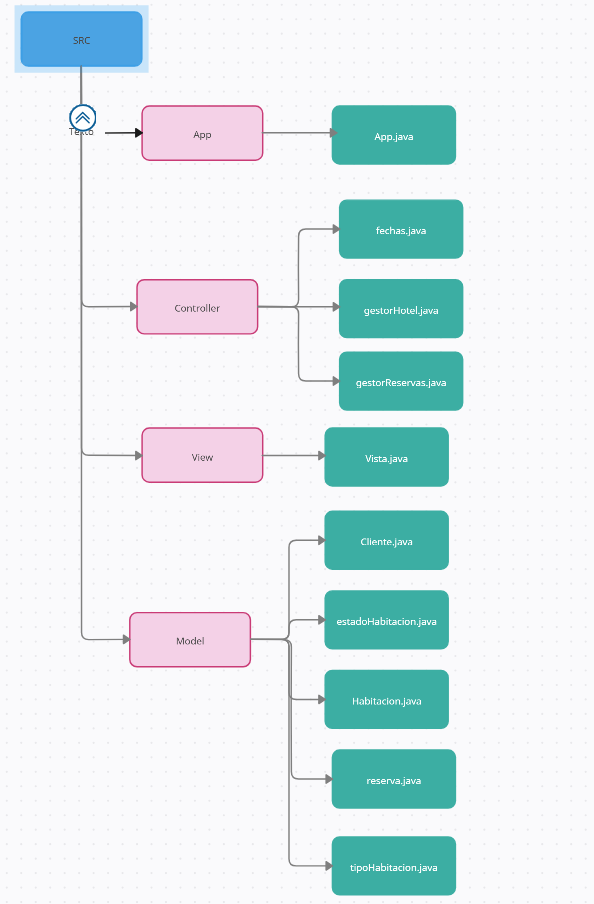

## Prestaciones del proyecto

### Menu principal

Contiene las opciones para controlar clientes y habitaciones

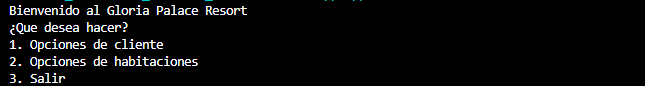

### Opciones de cliente

Contiene las opciones para listar todos los clientes (junto con sus reservas e historial), ver reservas individualmente y ver historial individualmente

### Opciones de habitaciones

Contiene las opciones para listar todas las habitaciones del hotel, realizar una reserva, cancelar una ya creada y buscar una habitación por un parámetro concreto

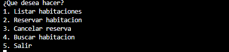

## Ejemplo de uso

Para mostrar el uso de la aplicación hemos creado a dos clientes:  
El cliente1 que tendra las reservas al máximo y el cliente2 que no tendra ninguna

### Caso del cliente1

Supongamos que el cliente1 quiere hacer una reserva, entrando en el menu de habitaciones y en la opción 2 (reservar habitación) está nos preguntará por la habitación a reservar

Probemos con una ya reservada, la 305:

Viendo que esta ya esta ocupada probemos con la 301:

Al estar disponible, se nos pedira el ID del cliente que quiere hacer la reserva, en este caso el cliente1 tiene la ID 1, introduciendolo veremos un error:

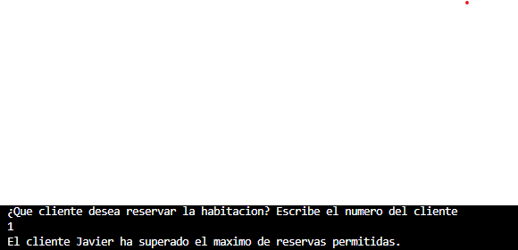

Podremos confirmar cuantas reservas tiene el cliente 1, desde el menu de clientes
en la opción 2 (ver reservas). Este nos preguntará por la ID del cliente y tras ponerla veremos una lista de ellas:

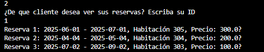

Ahora supongamos que el cliente 1 quiere cancelar una de sus reservas por ejemplo la reserva 3 (la habitación 303). Primero comprobemos el estado de la habitación con una busqueda:

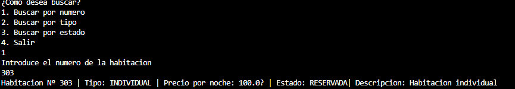

Para cancelar la reserva iremos desde las opciones de habitación a cancelar reserva. Una vez dentro se nos preguntara por la ID del cliente que quiere cancelar, tras ello se nos pedira la ID de la reserva. Si la operación es correcta, aparecera un mensaje con la información de la cancelación:

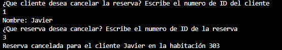

Para confirmar que se ha cancelado correctamente, primero miraremos las reservas del cliente 1 y posteriormente buscaremos la habitación 303

En está ocasión la buscaremos por número y como vemos en la imagen la habitación está diponible

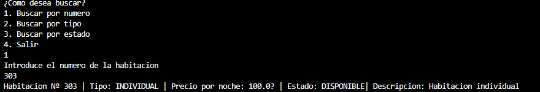

### Caso del cliente2

El cliente2 quiere hacer una reserva pero no tiene claro que habitaciones están disponibles, para comprobarlas usaremos la busqueda por estado DISPONIBLE:

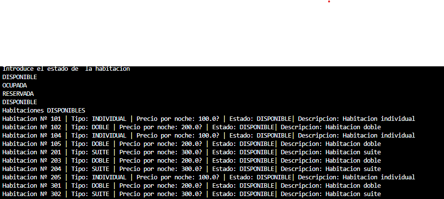

Además este cliente viene solo, asi que comprobaremos las de tipo INDIVIDUAL:

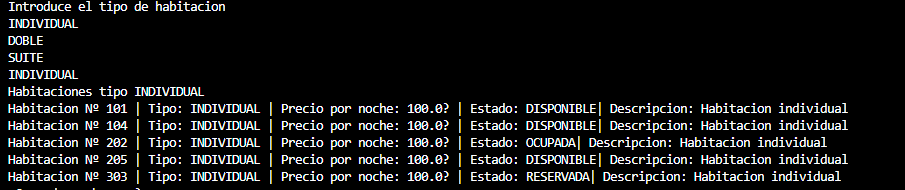

Una vez claras las elecciones disponibles, intentemos hacer una reserva en la habitación 101.  

Empezando con la reserva, primero nos preguntaran por la habitación a reservar, la ID del cliente que desea hacer la reserva, dia,mes y año para el checkIn y el checkOut. 

Probemos primero a poner una fecha del mes pasado para el checkIn:

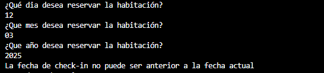

Y ahora una fecha correcta para el checkIn pero una anterior a esta para el checkOut. Debido a que son muchos pasos para llegar a este punto hemos decidido aplicarle el maximo de dias posibles a la reserva, y no repetir el procedimiento otra vez al usuario.

Si los datos son correctos veremos un mensaje de confirmación:

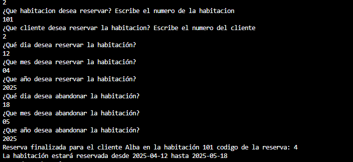

Comprobemos que la reserva se a guardado

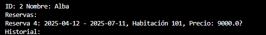

## Autores ✒️
Daniel Ramos Montoya  
José Antonio Alonso Navarro

## Dependency Management

The `JAVA PROJECTS` view allows you to manage your dependencies. More details can be found [here](https://github.com/microsoft/vscode-java-dependency#manage-dependencies).
